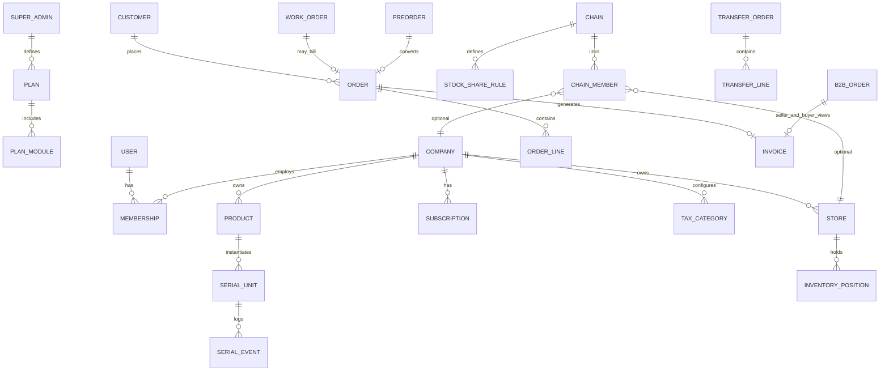

# LZ3C SaaS — Architecture & Domain Design

> Version: 0.1 · Market: Ireland-first, global-ready · Scale: ~30–50 stores

---

## 1. Product summary

Multi-tenant 3C retail & service SaaS for **Companies** (legal entities) operating **Stores**, optional **Warehouse** module, and paid **Chain** (virtual cross-company network). Super Admin composes **feature modules** into subscription plans (free = cropped features, paid = monthly via Stripe).

**Confirmed business rules (latest)**

| Topic | Decision |
|-------|----------|
| Daily close | Statistics only — **no** lock on editing historical transactions |
| Credit / 赊账 | **Does not exist** |
| Subscription | Stripe Customer on **Company**; each Company buys its own plan |
| Chain | Platform-level virtual org; not one legal entity |
| Pre-order | Full flow: deposit, balance, convert to sale, cancel + credit note |
| Expired plan | Read-only: no new sales/stock moves; query/export/print history OK |
| Tech | **Node required**; all other choices are recommendations below |

---

## 2. Technology stack (recommended)

### 2.1 Monorepo layout

```
lz3c/
├── apps/
│   ├── api/                 # NestJS HTTP API
│   ├── web/                 # React SPA (admin + POS + warehouse UI)
│   └── worker/              # Background jobs (optional separate process)
├── packages/
│   ├── shared/              # Zod schemas, types, tax calculators, i18n keys
│   ├── db/                  # Mongoose models & migrations
│   └── eslint-config/
├── infra/
│   ├── Dockerfile
│   └── docker-compose.yml   # local: api + redis + mongo
└── docs/
```

**Tooling:** pnpm workspaces + Turborepo · TypeScript 5.x · Node 22 LTS

### 2.2 Backend

| Layer | Choice | Why |
|-------|--------|-----|
| Framework | **NestJS** | Module boundaries match subscription features; guards/interceptors for tenant + read-only mode |
| Language | **TypeScript** | Shared types with frontend via `packages/shared` |
| API style | **REST** (+ OpenAPI/Swagger) | POS & printers integrate simply; predictable caching |
| Validation | **Zod** (shared) + `nestjs-zod` | Single schema for API + client |
| ODM | **Mongoose** on **MongoDB Atlas** | Flexible product/tax docs, SN as documents, invoice snapshots |
| Cache / queue | **Redis** (Upstash or GCP Memorystore) + **BullMQ** | SMS, PDF invoices, report generation, Stripe webhooks |
| Auth | **JWT** (access + refresh) + **httpOnly cookie** option for web | Multi-company user: `activeCompanyId` / `activeStoreId` in session claims |
| Payments | **Stripe Billing** (Customer per Company, Subscription per price) | Webhooks → `worker` |
| SMS | **Twilio** | Repair notifications |
| PDF | **Puppeteer** (HTML template → PDF) stored in **GCS** | Invoice archive & reprint |
| i18n | **i18next** (API error messages + static UI in `web`) | zh / en + company custom locale JSON in DB |
| IDs | **MongoDB ObjectId** + human-readable **document numbers** per company | |

### 2.3 Frontend

| Layer | Choice | Why |
|-------|--------|-----|
| UI | **React 19** + **Vite** | Fast POS screens; one app with role-based routes |
| UI kit | **shadcn/ui** + Tailwind | Tables, forms, dashboards |
| State | **TanStack Query** + **Zustand** (session context) | Server state + active company/store |
| Routing | **React Router** | Company dashboard → store drill-down |
| POS print | **CSS `@page`** 80mm + `window.print()` | No native app; system default printer |
| Scanner | Keyboard wedge | Input fields listen for rapid scan + Enter |
| Forms | **React Hook Form** + Zod | |

*Alternative:* Next.js only if you need SSR marketing site; for v1 a single Vite SPA is enough.

### 2.4 Infrastructure (GCP)

| Component | Choice |
|-----------|--------|
| Compute | **Cloud Run** (API + worker containers) or **GKE** if you prefer k8s early |
| Registry | **Artifact Registry** |
| Files | **Cloud Storage** (invoice PDFs, exports) |
| Secrets | **Secret Manager** (Stripe, Twilio, Atlas URI) |
| CI/CD | **GitHub Actions** → build image → deploy Cloud Run |
| DB | **MongoDB Atlas** (M10+ for prod; VPC peering optional later) |
| Redis | **Upstash** (simple) or **Memorystore** (same VPC) |
| DNS / TLS | **Cloud Load Balancer** + managed certs |

Dockerfile: multi-stage build, `node:22-alpine`, run as non-root.

### 2.5 What we are *not* adding in v1

- Elasticsearch (Mongo aggregation + indexes suffice at 50 stores)
- GraphQL
- Kafka
- Third-party accounting / e-invoice government APIs
- Immutable audit ledger (not required)

---

## 3. Feature modules & subscription matrix

Super Admin defines **modules** and bundles them into **plans**.

### 3.1 Module catalog

| Module ID | Name | Depends on |
|-----------|------|------------|
| `core` | Company, users, roles, products, tax categories | — |
| `pos` | Retail sales, 80mm receipt, payments | `core` |
| `inventory` | Inbound, stock, cost price | `core` |
| `serialized` | SN/IMEI lifecycle, traceability, replacement links | `inventory` |
| `service` | Price list, work orders, Twilio SMS | `core`, `serialized` |
| `preorder` | Deposits, conversion, cancel + credit note | `pos` |
| `report` | Daily stats, category/tax/payment/margin reports | `pos`, `inventory` |
| `b2b` | B2B orders, invoices (incl. Margin dual view) | `inventory` |
| `warehouse` | Warehouse role, scope to stores, wholesale | `b2b`, `inventory` |
| `chain` | Virtual chain, shared stock rules, cross-store flows | `inventory`, `b2b` |
| `crm` | Light CRM (shared customer master) | `core` |

**Free plan example:** `core` + `pos` + `inventory` (no `chain`, `warehouse`, `b2b`, `service`).

**Paid tiers:** add modules; **chain** always extra add-on.

### 3.2 Subscription enforcement

```
Request → AuthGuard → CompanyContextGuard → SubscriptionGuard(moduleId)
                                              ↓
                                    expired? → ReadOnlyGuard (block writes except export)
```

**Read-only allowlist:** GET*, export PDF, print historical invoice, list SN history.

**Read-only blocklist:** POST/PATCH/DELETE on orders, stock, work orders, transfers.

---

## 4. Domain model

### 4.1 ER (logical)



### 4.2 Tenant boundaries

| Data | Scope |
|------|-------|
| Product, tax, price list | `companyId` |
| Stock quantity, SN location | `storeId` (warehouse = store with `modules.warehouse`) |
| Orders, invoices, transfers | `companyId` + `storeId` |
| Chain rules | `chainId` (cross-company references by ID only) |
| Customer | `companyId` (shared POS + CRM) |

### 4.3 Chain (virtual org)

```typescript
Chain {
  _id, name, ownerUserId,   // creator / billing contact for chain add-on
  memberStoreIds: ObjectId[],
  memberCompanyIds: ObjectId[],  // denormalized for queries
  createdAt
}
ChainMember { chainId, companyId, storeId, joinedAt }
StockShareRule {
  chainId, sourceStoreId,
  mode: 'quantity' | 'percent',
  value: number,
  visiblePrice: 'cost' | 'wholesale'   // auto: same company → cost, else wholesale
}
```

### 4.4 Serial number (first-class)

```typescript
SerialUnit {
  _id, companyId, productId,
  sn: string,              // unique per company
  status: string,          // merchant-defined enum set
  purchaseCost: Decimal,   // pre-tax, for Margin VAT
  currentStoreId,
  replacedBySnId?, replacesSnId?,
  notes[]
}
SerialEvent { serialUnitId, type, fromStatus?, toStatus?, refType, refId, at, by }
```

**Replacement:** new `SerialUnit` created; `replacesSnId` / `replacedBySnId` linked; events on both.

### 4.5 Product types

| `productType` | Stock model |
|---------------|-------------|
| `serialized` | Positions count + `SerialUnit` rows |
| `sku` | `skuCode` + qty on `InventoryPosition` |
| `simple` | name + qty |
| `service` | no stock; price from price list |

All products: `costPrice` (pre-tax) required. With warehouse module: `wholesalePrice`, `retailPrice` (retail = tax-included).

### 4.6 Tax calculation service (`packages/shared`)

```typescript
type TaxScheme = 'zero' | 'standard_13_5' | 'standard_23' | 'margin_23';

function lineTax(scheme, { salePriceIncVat, costPreTax, wholesalePreTax, perspective }): {
  netPreTax, vatAmount, gross
}
```

- **B2C POS:** store inc-VAT prices; receipt hides VAT breakdown.
- **B2B Margin seller invoice:** VAT = `(wholesalePreTax - costPreTax) * 23 / 123`.
- **B2B Margin buyer invoice:** lines at pre-tax wholesale, **no VAT lines**.

### 4.7 Document types & number sequences

Per `companyId`, separate counters:

| `docType` | Prefix example | VAT |
|-----------|----------------|-----|
| `receipt` | R-2026-00001 | hidden on print |
| `invoice_b2b` | INV-2026-00001 | yes (seller view) |
| `invoice_b2b_buyer` | optional duplicate record or same doc + `view: buyer` | no VAT display |
| `transfer` | TR-2026-00001 | no |
| `credit_note` | CN-2026-00001 | reverses source |

**Invoice snapshot** (immutable JSON + PDF URL) includes: seller/buyer legal fields, VAT numbers, addresses, contacts, bank details, lines, totals.

---

## 5. Key state machines

### 5.1 Work order (repair)

**Type A — in-store**

```
draft → in_progress → awaiting_payment → completed
                    ↘ cancelled
```

**Type B — send-out**

```
draft → sent_out → in_repair → returned → awaiting_payment → completed
     ↘ cancelled (any pre-completion)
```

SMS triggers: `awaiting_payment` (price confirm), `completed` (ready pickup).

### 5.2 B2B order (cross-company / warehouse)

```
draft → confirmed → shipped → received → invoiced
                              ↘ payment_status: unpaid | paid (manual update + payment method)
```

Seller creates **seller invoice** on `invoiced`; buyer sees **buyer view** (no VAT on Margin goods).

### 5.3 Internal transfer (same company)

```
draft → confirmed → shipped → received
```

No invoice; moves stock at **cost**; no Margin base change.

### 5.4 Pre-order

```
draft → deposit_paid → ready → converted_to_sale → closed
      ↘ cancelled → credit_note_issued (if deposit refunded)
```

### 5.5 Serial unit (simplified)

```
in_stock → reserved → sold | in_repair → in_stock | damaged | written_off
```

Merchant extends `Company.serialStatuses[]`.

---

## 6. MongoDB collections (v1)

| Collection | Indexes (partial) |
|------------|-------------------|
| `users` | `email` unique |
| `memberships` | `{ userId, companyId }`, `{ companyId, storeId, role }` |
| `companies` | `stripeCustomerId` |
| `stores` | `{ companyId }`, `{ modules.warehouse: 1 }` |
| `subscriptions` | `{ companyId, status }` |
| `plans` / `plan_modules` | admin |
| `chains` / `chain_members` / `stock_share_rules` | `{ chainId }`, `{ sourceStoreId }` |
| `tax_categories` | `{ companyId }` |
| `products` | `{ companyId, productType }`, `{ companyId, skuCode }` |
| `serial_units` | `{ companyId, sn }` unique, `{ currentStoreId, status }` |
| `serial_events` | `{ serialUnitId, at }` |
| `inventory_positions` | `{ storeId, productId }` unique |
| `customers` | `{ companyId, phone }` |
| `orders` | `{ companyId, storeId, createdAt }`, `{ docNumber }` unique per company |
| `work_orders` | `{ companyId, serialUnitId, status }` |
| `b2b_orders` | `{ sellerCompanyId, buyerCompanyId, status }` |
| `transfer_orders` | `{ companyId, status }` |
| `preorders` | `{ companyId, status }` |
| `invoices` | `{ companyId, docNumber }`, `{ b2bOrderId }` |
| `document_sequences` | `{ companyId, docType, year }` unique |
| `inbound_receipts` | `{ companyId, storeId }` |
| `daily_summaries` | `{ storeId, businessDate }` unique |
| `locales` | `{ companyId, lang }` custom strings |

---

## 7. API module map (NestJS)

```
AppModule
├── AuthModule
├── AdminModule          # Super Admin: plans, modules
├── CompanyModule
├── StoreModule
├── UserModule / MembershipModule
├── SubscriptionModule   # Stripe webhooks, guards
├── ProductModule
├── SerialModule
├── InventoryModule
├── PosModule
├── ServiceModule        # work orders, price list
├── PreorderModule
├── B2bModule
├── WarehouseModule
├── ChainModule
├── InvoiceModule
├── TransferModule
├── ReportModule
├── CrmModule
├── NotificationModule   # Twilio
└── I18nModule
```

**Context headers:** `X-Company-Id`, `X-Store-Id` (validated against membership).

---

## 8. Daily close (statistics only)

- **No** edit lock on closed days.
- `daily_summaries` aggregated from orders/payments by `businessDate` + `storeId`.
- Includes: card, cash, other payment methods; **open work orders** counted as pipeline metric, not 赊账.
- User can regenerate summary anytime (idempotent upsert).

---

## 9. Security & isolation

- Every query filters `companyId` from JWT + header.
- Store-level roles restrict `storeId` unless user is company admin.
- Chain cross-company queries only return **SKU + qty + allowed price field**.
- IMEI/SN never exposed in chain shared catalog API.

---

## 10. Implementation phases (all modules v1 — suggested build order)

| Phase | Weeks (indicative) | Deliverable |
|-------|-------------------|-------------|
| 1 | 2–3 | Monorepo, auth, company/store/user, subscription + read-only |
| 2 | 2–3 | Products, tax engine, inventory, serial units |
| 3 | 2 | POS, receipts, customers |
| 4 | 2 | Service / work orders + Twilio |
| 5 | 2 | Pre-order + credit notes |
| 6 | 2 | B2B, invoices (dual Margin view), warehouse |
| 7 | 2 | Chain, stock sharing, transfers |
| 8 | 1–2 | Reports, CRM, i18n, PDF, deploy pipeline |

---

## 11. Open items (none blocking)

All prior blocking questions are resolved. Optional later:

- Marketing landing site (separate Next.js or static)
- Email notifications (Resend)
- Accounting export (CSV/Xero)

---

## 12. Default answers applied (archive)

| # | Topic | Final |
|---|-------|-------|
| 1 | Daily close | C — stats only |
| 2 | Stripe | Per Company |
| 3 | Chain | Virtual platform org |
| 4 | Pre-order | Full flow |
| 5 | Credit | None |
| 6 | Expired | Read-only per earlier spec |
